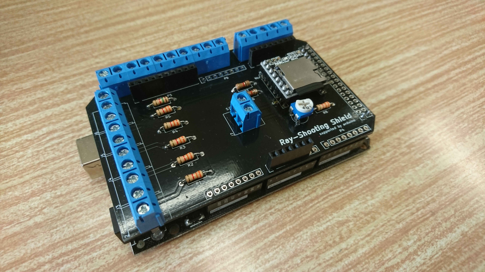

# Ray-Shooting
マイコン制御したレーザーポインターとCdSセルを使用した射的ゲーム  
2018年~2019年にかけて学校祭での出展を主導した。  

企画の様子

1年目の構成  
レーザ銃  
　PIC 16f648a  
　レーザダイオード  
　リレー  
　3端子レギュレータ  
　7セグメントLED 他  

的  
　CdSセル  
　コンパレータIC  
　サーボモーター  
　サーボモータードライバ  
　arduino MEGA  
　ノートPC(スコア表示)  

2年目の構成  
レーザ銃  
　PIC 16f648a  
　レーザダイオード  
　MOSFET  
　リレー  
　3端子レギュレータ　他  

的  
　CdSセル  
　arduino MEGA  
　自作シールド  
　LED  
　DFPlayerMini  
　ノートPC（スコア表示）  

